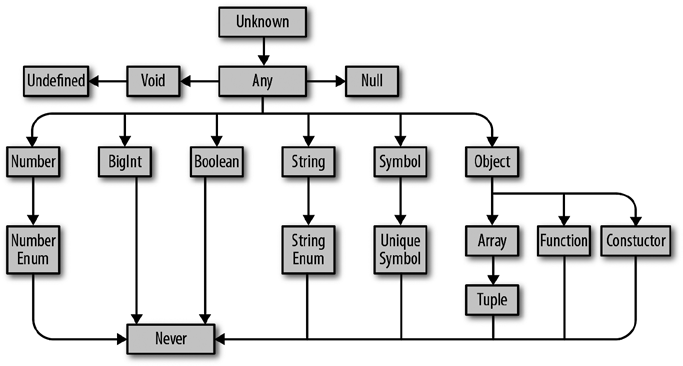

# Подробно о типах

**Тип** - набор значений и применимых к ним операций.

Например:

* Тип boolean представляет набор всех логических значений (их два: true и false) и операций, применимых к ним (вроде ||, && и !);
* Тип number представляет набор всех чисел и допустимых для них операций (вроде +, -, \*, /, %, ||, && и ?), включая методы, которые можно для них вызывать, такие как .toFixed, .toPrecision, .toString;
* Тип string представляет набор всех строк и производимых с ними операций (вроде +, || и &&), включая методы, которые можно для них вызывать, такие как .concat, .toUpperCase

Встречая тип, вы сразу понимаете, что можно и чего нельзя сделать с его обладателем. Модуль проверки типов не позволяет вам совершать неверные действия, ориентируясь на то, какие типы и как именно вы используете.



## Типы в TS

### any

any выступает в роли крестного отца всех типов. За соответствующую плату он готов, но лишний раз прибегать к его помощи вы вряд ли захотите. TypeScript в момент компиляции у всего должен быть тип, и any становится типом по умолчанию там, где вы (программист) и TypeScript (модуль проверки) не можете точно определить тип элемента. Можно охарактеризовать его как тип крайнего случая.

Почему же его стоит избегать? Вспомните, чем является тип? Правильно. **Это набор значений и доступных для них действий**. any же представляет собой набор всех возможных значений, и вы можете делать с ним все что угодно: прибавлять к нему, умножать на него, вызывать для него .pizza() и т. д.

```
let a: any = 666 // any
let b: any = ['danger'] // any
let c = a + b // any заметте тут склдываем числа с массивом и нет никакой ошибки!
```

### unknown

В случае, когда у вас есть значение, чей тип вы узнаете позднее, вместо any примените unknown. Он представляет любое значение, но чтобы использовать это значение, TypeScript потребует уточнить его тип.

Какие же операции поддерживает unknown? Вы можете сравнивать значения unknown (==, ===, ||, && и ?), отрицать их (!) и уточнять (как и любой другой тип через JavaScript-операторы typeof и instanceof).

> Для лучшего запоминания я вывел для себя правило - операции, которые поддерживает bolean поддерживает и unknown.

```
let a: unknown = 30 // unknown
let b = a === 123 // boolean
let c = a + 10 // Ошибка TS2571: объект имеет тип 'unknown'.
if (typeof a === 'number') {
    let d = a + 10 // number
}
```

Этот пример дает общее представление об использовании unknown.

1. TypeScript никогда не выводит unknown — этот тип нужно явно аннотировать (a);
2. Можно сравнивать значения со значениями типа unknown;
3. Нельзя производить действия на основе предположения, что значение unknown имеет конкретный тип (c). Сначала нужно показать TypeScript наличие этого типа (d).

### boolean

Тип boolean (логический) имеет всего два значения: true и false. Такие типы можно сравнивать (==, ===, ||, && и ?) и отрицать (!). Используются они так:

```
let a = true // boolean
var b = false // boolean
const c = true // true
let d: boolean = true // boolean
let e: true = true // true
let f: true = false // Ошибка TS2322: тип 'false' не может быть
// присвоен типу 'true'.
```

Согласно этому примеру, чтобы сообщить TypeScript, что некий элемент имеет тип boolean, можно сделать следующее:

1. Позволить TypeScript вывести тип boolean для значения (a и b).
2. Позволить TypeScript вывести конкретное значение boolean (c).
3. Явно сообщить TypeScript, что значение является boolean (d).
4. Явно сообщить TypeScript, что значение имеет конкретное значение boolean (e и f).

Обратите внимание на 3, 5 строчки кода поскольку хоть они и делают нечто естественное, поддерживаются они на удивление малым количеством языков и могут оказаться для вас незнакомыми. В том примере я обратился к TypeScript: «Видишь эту переменную с? Она не просто какой-то там boolean, а совершенно конкретный Boolean — true». Использовав значение в качестве типа, я существенно ограничил возможные для e и f значения boolean, определив для каждого конкретное, — создал литералы типов.

**Литерал типа** - тип, представляющий только одно значение и ничто другое.

В четвертом случае я явно аннотировал переменные литералами типов, а во втором TypeScript вывел литералы типов за меня, потому что я использовал const вместо let или var. TypeScript знает, что значение примитива, присвоенного с const, не меняется, и выводит для этой переменной максимально узкий тип. Именно поэтому во втором случае TypeScript вывел тип c как true вместо boolean.

### number

Тип number представляет набор чисел: целочисленные, с плавающей запятой, положительные, отрицательные, Infinity (бесконечность), NaN и т. д. Для чисел доступно достаточно много действий: сложение (+), вычитание (-), деление по модулю (%) и сравнение (<). Рассмотрим примеры:

```
let a = 1234 // number
var b = Infinity * 0.10 // number
const c = 5678 // 5678
let d = a < b // boolean
let e: number = 100 // number
let f: 26.218 = 26.218 // 26.218
let g: 26.218 = 10 // Ошибка TS2322: тип '10' не может быть
// присвоен типу '26.218'.
```

Для типизации с помощь number можно сделать следующее:

1. Позволить TypeScript вывести тип значения как number (a и b);
2. Использовать const, чтобы TypeScript вывел тип переменной как конкретное число (number) (c);
3. Явно сообщить TypeScript, что значение имеет тип number (e);
4. Явно сообщить, что значение имеет конкретный тип number (f и g).

Так же как и с boolean, лучше доверить вывод типа TypeScript (первый вариант). Иногда при утонченном описании программы потребуется ограничить тип конкретным значением (второй и четвертый варианты). На практике нет причин явно типизировать значение как number (третий вариант).

### bigint

Тип bigint является новичком в JavaScript и TypeScript. Он позволяет работать с крупными целочисленными значениями без риска столкнуться с ошибками округления. В то время как number может представлять целые числа только до 253, bigint способен представить и большие значения. Этот тип является набором всех BigInts и поддерживает такие действия, как сложение (+), вычитание (-), умножение (\*), деление (/) и сравнение (<). Используется он так:

```
let a = 1234n // bigint
const b = 5678n // 5678n
var c = a + b // bigint
let d = a < 1235 // boolean
let e = 88.5n // Ошибка TS1353: литерал bigint должен быть
// целым числом.
let f: bigint = 100n // bigint
let g: 100n = 100n // 100n
let h: bigint = 100 // Ошибка TS2322: тип '100' не может быть
// присвоен типу 'bigint'.
```

Аналогично boolean и number есть четыре варианта объявления bigint. Старайтесь позволять TypeScript делать их вывод за вас.

### string

Тип string является набором всех строк и доступных для них операций вроде конкатенации (+), среза (.slice) и т. д. Вот несколько примеров:

```
let a = 'hello' // string
var b = 'billy' // string
const c = '!' // '!'
let d = a + ' ' + b + c // string
let e: string = 'zoom' // string let f: 'john' = 'john' // 'john'
let g: 'john' = 'zoe' // Ошибка TS2322: тип "zoe" не может быть
// присвоен типу "john".
```

Как и в случае с boolean и number, тип string можно объявить одним из четырех способов, и лучше, если это сделает сам TypeScript.

### symbol

Тип symbol появился с одной из последних ревизий JavaScript (ES2015). На практике символы встречаются нечасто. Они используются в качестве альтернативы строчных ключей в объектах и картах там, где вы хотите быть абсолютно уверены, что пользователи применяют верный, хорошо известный ключ и по случайности не установят другой. Подумайте, устанавливая итератор по умолчанию для объекта (Symbol.Iterator) или переназначая ключ в среде выполнения, не является ли объект экземпляром чего-либо (Symbol.Instance). Символы обозначаются типом symbol и не предполагают много действий:

```
let a = Symbol('a') // symbol
let b: symbol = Symbol('b') // symbol
var c = a === b // boolean
let d = a + 'x'
```

### object

В TypeScript есть несколько способов использования типов для описания объектов. Первый заключается в объявлении значения в качестве object:

```
let a: object = {
    b: 'x'
}
```

Что произойдет, когда вы обратитесь к b?

```
a.b // Ошибка TS2339: свойство 'b' не существует в типе 'object'.
```

Но какой смысл присваивать чему-либо тип object, если потом ничего нельзя делать? На самом деле смысл есть. В малой степени object является any. Этот тип сообщает вам о значении, которому он присвоен, только то, что оно является объектом JavaScript (и оно не null).

А что, если мы оставим явные аннотации и позволим TypeScript делать свою работу?

```
let a = {
    b: 'x'
} // {b: string}
a.b
```

Вуаля! Вы только что открыли второй способ типизации объекта: синтаксис объектного литерала. Вы можете либо позволить TypeScript вывести форму объекта, либо описать ее явно, используя фигурные скобки {}:

```
let a: {b: number} = {
    b: 12
} // {b: number}
```

В общей сложности выходит четыре способа объявления объектов в TypeScript:

1. Объявление объектного литерала (вроде {a: string}), называемого также формой. Используйте ее, когда знаете, какие поля будет иметь объект, или когда все его значения будут иметь один тип.
2. Объявление пустого объектного литерала ({}). Старайтесь его избегать.
3. Тип object. Используйте его, когда вам просто нужен объект и неважно, какие у него поля.
4. Тип Object. Старайтесь его избегать.

### array

Как и в JavaScript, в TypeScript массивы являются особыми объектами, поддерживающими конкатенацию, передачу, поиск и срезы. Вот пример:

```
let a = [1, 2, 3] // number[]
var b = ['a', 'b'] // string[]
let c: string[] = ['a'] // string[]
let d = [1, 'a'] // (string | number)[]
const e = [2, 'b'] // (string | number)[]

let f = ['red']
f.push('blue')
f.push(true) // Ошибка TS2345: аргумент типа
// 'true' не может быть присвоен
// параметру типа 'string'.

let g = [] // any[]
g.push(1) // number[]
g.push('red') // (string | number)[]

let h: number[] = [] // number[]
h.push(1) // number[]
h.push('red') // Ошибка TS2345: аргумент типа
// '"red"' не может быть присвоен
// параметру типа 'number'.
```

По мере ознакомления с примерами обратите внимание, что все, кроме с и h, типизировано неявно и есть правила относительно того, что можно, а что нельзя помещать в массив.

### tuples (кортежи)

Кортежи являются подтипами array. Они позволяют типизировать массивы фиксированной длины, в которых значения каждого индекса имеют конкретные известные типы. В отличие от большинства других типов, кортежи в момент их объявления должны типизироваться явно.

```
let a: [number] = [1]

// Кортеж [имя, фамилия, год рождения]
let b: [string, string, number] = ['malcolm', 'gladwell', 1963]

b = ['queen', 'elizabeth', 'ii', 1926] // Ошибка TS2322: тип
// 'string' не может быть присвоен типу 'number'.
```

Кортежи также поддерживают опциональные элементы. Как и для типов object, опциональность обозначается знаком **?**:

```
// Массив железнодорожных тарифов, который может меняться
// в зависимости от направления
let trainFares: [number, number?][] = [
    [3.75],
    [8.25, 7.70],
    [10.50]
]

// Эквивалент:
let moreTrainFares: ([number] | [number, number])[] = [
// ...
]
```

Кортежи также поддерживают оставшиеся элементы, которые вы можете использовать для типизации кортежей минимальной длины:

```
// Список строк с как минимум одним элементом
let friends: [string, ...string[]] = ['Sara', 'Tali', 'Chloe', 'Claire']

// Разнородный список
let list: [number, boolean, ...string[]] = [1, false, 'a', 'b', 'c']
```

### null, undefined

В TypeScript тип undefined может иметь только одно значение — undefined, то же касается и типа null.

_undefined _означает, что нечто еще не было определено, а _null _показывает отсутствие значения.

#### void и never

Типы void и never проводят различие между несуществующими вещами:&#x20;

**void **— это возвращаемый тип функции, которая не возвращает ничего явно (например, console.log).&#x20;

**never **— это тип функции, которая никогда ничего не возвращает (выбрасывает исключение или выполняется бесконечно):

```
// (a) Функция, возвращающая число или null
function a(x: number) {
    if (x < 10) {
        return x
    }
    return null
}

// (b) Функция, возвращающая undefined
function b() {
    return undefined
}

// (c) Функция, возвращающая void
function c() {
    let a = 2 + 2
    let b = a * a
}

// (d) Функция, возвращающая never
function d() {
    throw TypeError('I always error')
}

// (e) Другая функция, возвращающая never
function e() {
    while (true){ 
        doSomething()
    }
}
```

