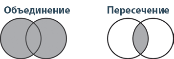

# Псевдонимы типов

Подобно тому как вы используете декларации (let, const и var) для объявления переменной, выступающей псевдонимом значения, вы также можете объявлять псевдоним типа, указывающий на тип. Выглядит это так:

```
type Age = number
type Person = {
    name: string
    age: Age
}
```

Age может быть только number. Это также помогает облегчить понимание определения формы Person. TypeScript не делает вывод псевдонимов, поэтому их нужно объявлять явно:

```
let age: Age = 55
let driver: Person = {
    name: 'James May'
    age: age
}
```

Как и в случае с объявлением переменных (let, const и var), объявить тип дважды нельзя:

```
type Color = 'red'
type Color = 'blue' // Ошибка TS2300: повтор идентификатора 'Color'.
```

### Типы объединения и пересечения

Объединением A и B будет их сумма (все, что есть в A, или в B, или в обоих), пересечение же — это то, что у них есть общего (все, что есть и в A, и в B). Представим это как наборы (рис. 3.2). Слева изображено объединение (сумма) двух наборов, а справа — их пересечение (произведение).



TypeScript предоставляет специальные операторы типов для описания объединений и пересечений: | для объединения и & для пересечения.

```
type Cat = {name: string, purrs: boolean}
type Dog = {name: string, barks: boolean, wags: boolean}
type CatOrDogOrBoth = Cat | Dog
type CatAndDog = Cat & Dog
```
